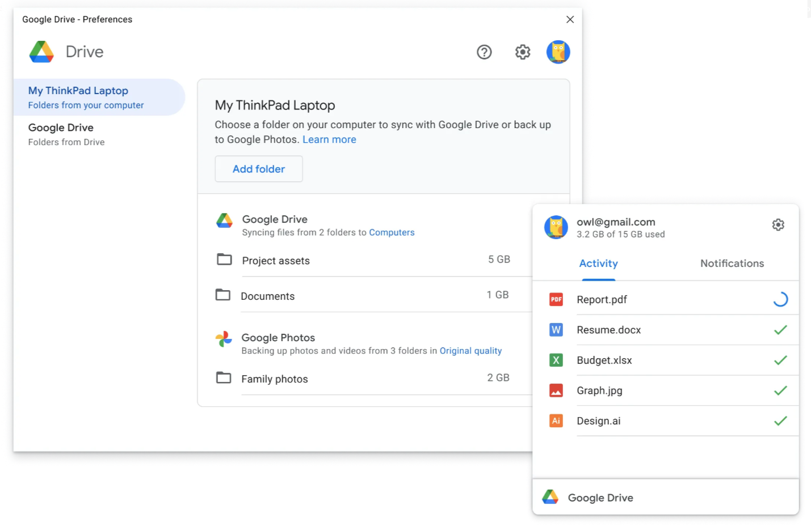
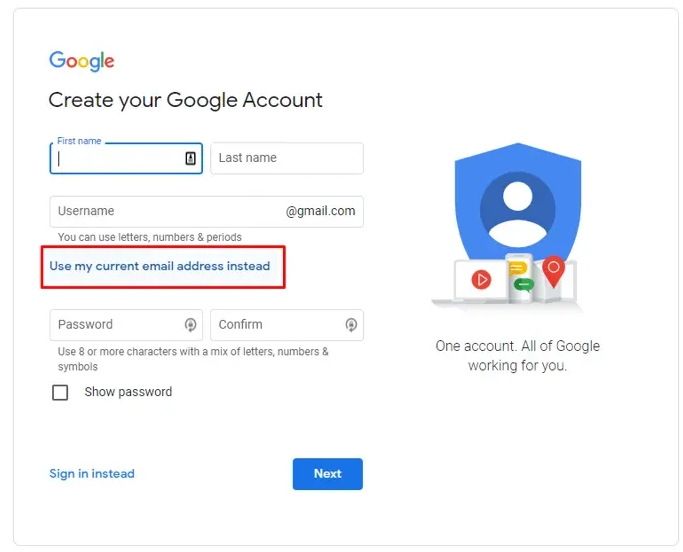
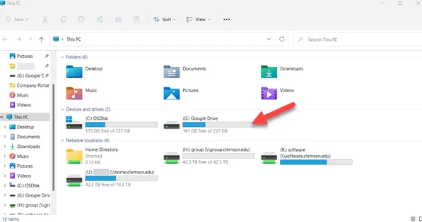
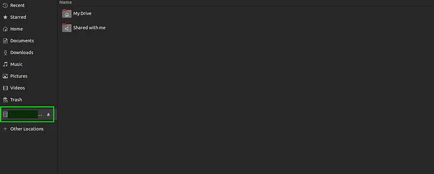

We all have files that are impossible or extremely painful to recreate — personal photos, project documents, source code, invoices, certificates, notes, or years of collected data.

Losing them because of a hard drive failure, accidental deletion, ransomware attack, or laptop theft can be devastating.

In this guide, I’ll show you how to automatically sync important files to Google Drive so your critical data is always backed up and recoverable.

---



## Why Auto-Sync Matters

Most people manually upload files to cloud storage occasionally.

The problem is:

- You forget
- Files change frequently
- New folders are never uploaded
- Your latest work may never get backed up

Automatic syncing solves this by continuously keeping your local files and cloud storage in sync.

Benefits include:

- Automatic backups
- Version history
- Easy recovery
- Access from multiple devices
- Protection against hardware failure
- Safer collaboration

---

## What You’ll Need

Before starting, make sure you have:

- A Google account
- Google Drive installed on your computer
- A folder containing important files
- Internet access

---

# Step 1 : Install Google Drive for Desktop

Download Google Drive for Desktop:

👉 https://www.google.com/drive/download/

Install the application and sign in using your Google account.

---



---

# Step 2 : Choose the Folder You Want to Protect

Identify folders that contain irreplaceable files.

Examples:

- Documents
- Photos
- Projects
- Work files
- Personal archives
- Notes
- Financial records

Create a dedicated folder if needed.

Example:

### Windows

```bash
C:\ImportantFiles
```

### Linux/macOS

```bash
/home/user/ImportantFiles
```

---

# Step 3 : Configure Google Drive Sync

Open **Google Drive for Desktop**.

Navigate to:

```text
Preferences → My Computer → Add Folder
```

Select the folder you want to back up.

Choose:

- **Sync with Google Drive**
or
- **Back up to Google Photos** (for image folders)

Click **Done**.

---

# Step 4 : Verify Automatic Syncing

Add or modify a file inside the synced folder.

Wait a few seconds and confirm the file appears in:

👉 https://drive.google.com

If it appears there, your sync is working correctly.

---

# Step 5 : Enable Offline Access (Optional)

For additional reliability, enable offline access.

This ensures you can still access important files even when disconnected from the internet.

Inside Google Drive settings:

```text
Preferences → Google Drive → Mirror Files
```

This keeps a local copy on your machine.


---

# Recommended Backup Strategy

For maximum protection, follow the **3-2-1 Backup Rule**:

- 3 copies of your data
- 2 different storage types
- 1 offsite backup

Example:

| Copy | Location |
|---|---|
| Original | Laptop/Desktop |
| Backup #1 | External HDD |
| Backup #2 | Google Drive |

---

# Extra Protection Tips

## Use Version History

Google Drive keeps previous versions of files.

This is extremely useful when:

- Files become corrupted
- You accidentally overwrite content
- Ransomware encrypts local files

---

## Encrypt Sensitive Files

For confidential documents, consider encrypting files before syncing.

Tools:

- VeraCrypt
- Cryptomator
- 7-Zip (encrypted archives)

---



---



---

## Monitor Storage Usage

Google accounts have limited free storage.

Check usage here:

👉 https://one.google.com/storage

---

# Common Mistakes to Avoid

## Syncing Entire System Drives

Avoid syncing your whole operating system or application folders.

Only sync important personal data.

---

## Ignoring Sync Errors

Occasionally verify:

- Files are actually uploading
- There are no sync conflicts
- Storage is not full

---

## No Secondary Backup

Cloud storage alone is not enough.

Always maintain another offline backup.

---

# Final Thoughts

Automatic syncing to Google Drive is one of the simplest and most effective ways to protect valuable files from permanent loss.

Once configured, the system works quietly in the background and dramatically reduces the risk of losing critical data.

If your files matter, automate their protection today instead of relying on memory or manual uploads.

---

# Useful Links

- Google Drive Download  
  https://www.google.com/drive/download/

- Google Drive Web  
  https://drive.google.com/

- Google One Storage  
  https://one.google.com/storage

---