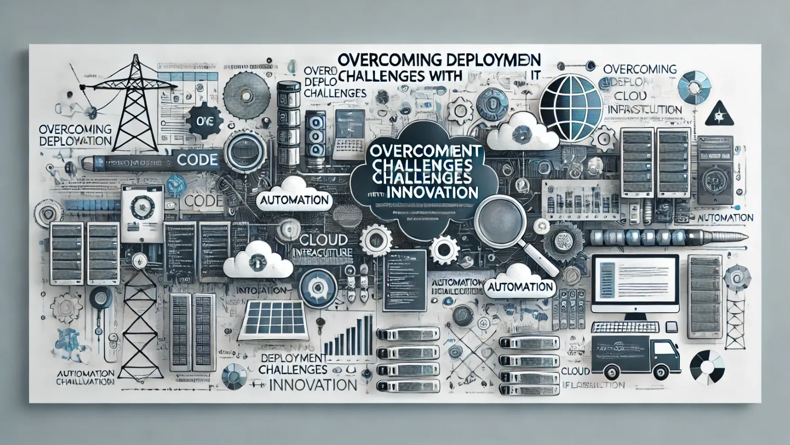

In a recent project I worked on, we implemented a robust CI/CD pipeline. As part of this deployment process, we wanted to automatically suppress alerts during the deployment period to ensure that our monitoring system wouldn’t interfere with the updates. However, we faced a considerable challenge: our monitoring tool, ICINGA, was running on an older version that lacked the essential API functionality needed to automate alert suppression. Due to various constraints, upgrading ICINGA wasn’t a feasible option at that time. However, we upgraded to a newer version a few months later.

Personally, I’m not a fan of depending on workarounds. I prefer finding more direct solutions to problems. But in this case, we found ourselves in a situation where the only way to overcome the issue was by using a workaround. The challenge was finding a way to implement the alert suppression because it was blocking us from calling the solution a truly automated end-to-end process.

To overcome this, we repurposed Playwright, a famous UI test automation tool, to handle the task. With a minimum effort, we wrote a Python script to run the scenarios decide the values and create downtimes in ICINGA by accessing the UI through a service user account. This enabled us to manage alert suppression in a way that fits our deployment process.

While this approach wasn’t ideal, it worked as a temporary solution until we could upgrade ICINGA and enable the API feature. Once the upgrade is complete, the solution will require rework, but in the meantime, it allowed us to reduce deployment time, and manual work during the deployment and continue without disruption. This experience backed the idea that sometimes success comes from thinking outside the box and being flexible with our methods. We achieved our goal, and it reminded me that innovation often arises when we creatively solve problems. It also highlighted the importance of being adaptable and resourceful, no challenge is too big when you’re willing to find new solutions.